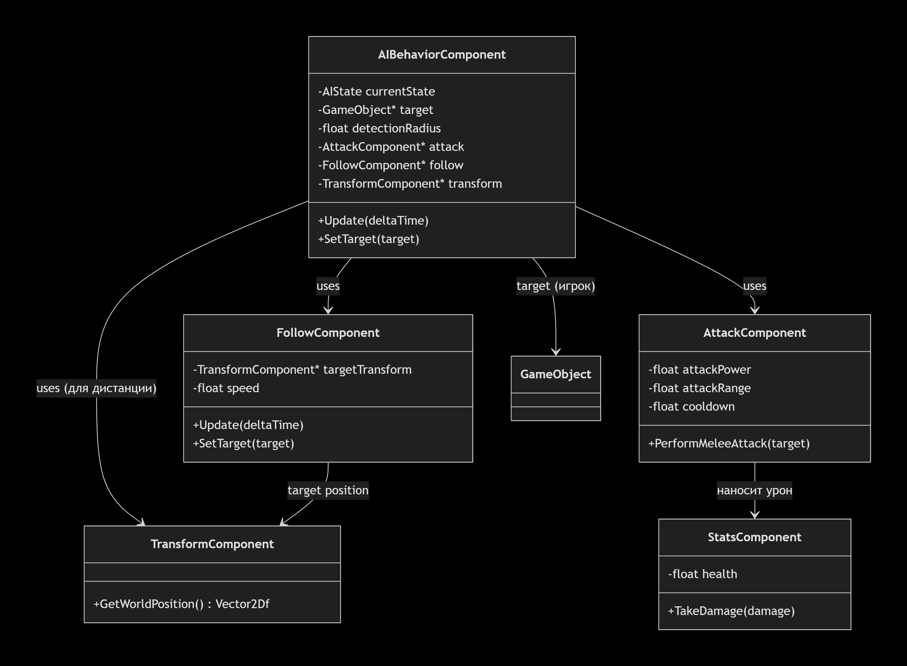
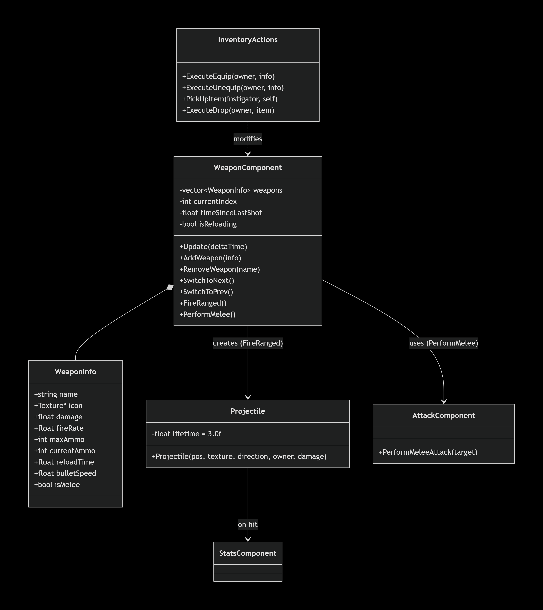
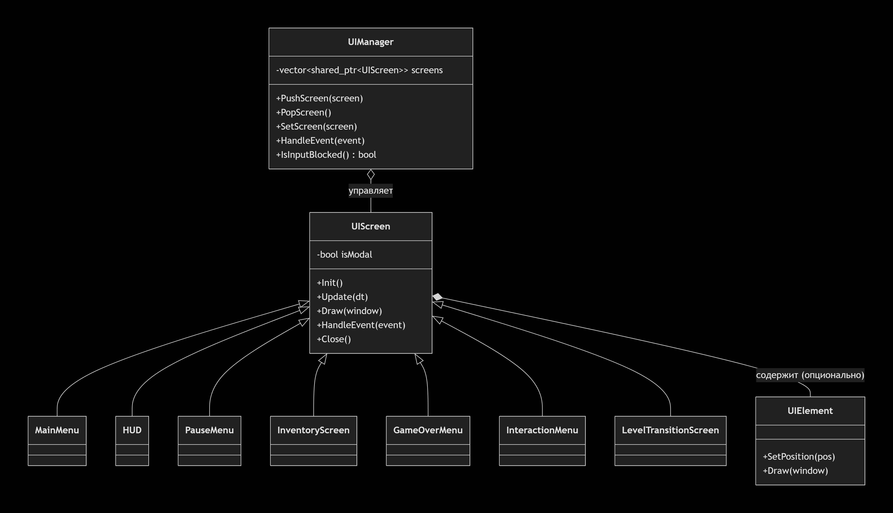
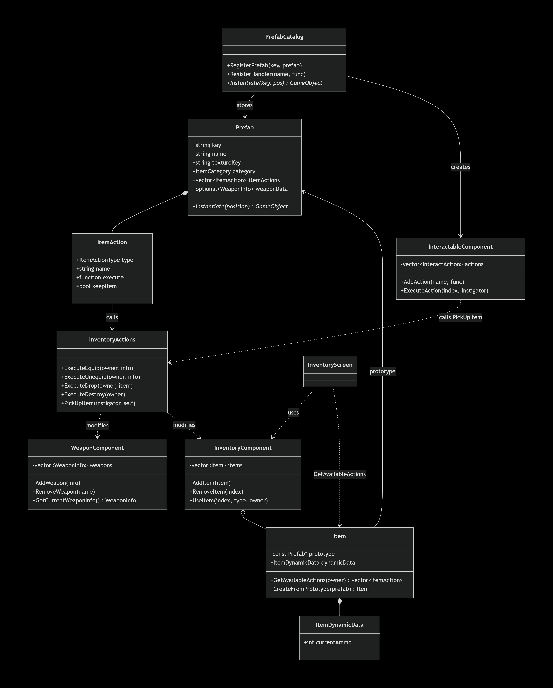
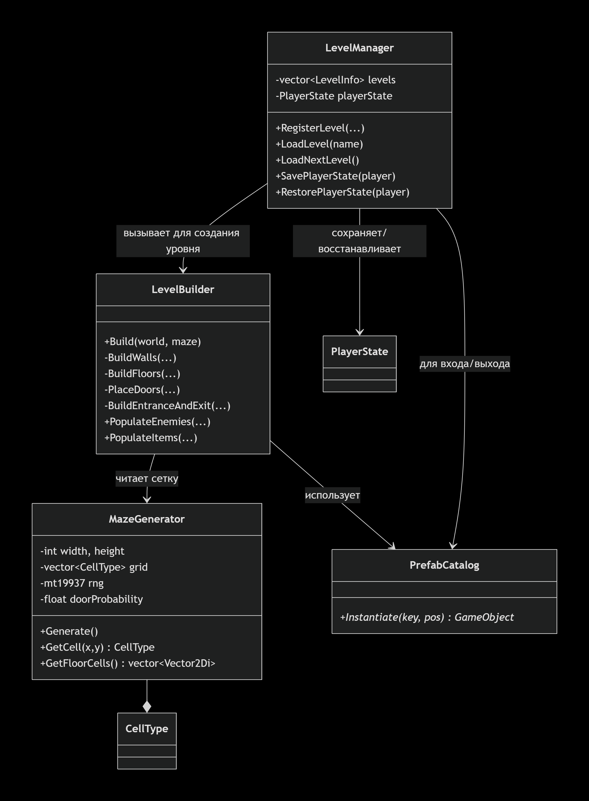

# Design Document: Creta Roguelite (рабочее название)

## 1. Общее описание игры (Game Overview)
- **Жанр:** 2D top-down action roguelite / survival horror
- **Платформа:** Windows (в перспективе — macOS, Linux)
- **Краткое описание:**  
  Игрок управляет оперативником спецподразделения, исследующим процедурно генерируемые комплексы и джунгли, кишащие динозаврами.  
  Цель — выполнить задание (активировать терминал, найти артефакт, уничтожить гнездо) и эвакуироваться. Смерть перманентна, но между забегами открываются новые виды оружия, предметы и улучшения.
- **Ключевые особенности:**
  - Процедурная генерация уровней-лабиринтов
  - Боевая система: огнестрельное оружие и ближний бой
  - Инвентарь в стиле Resident Evil / Dino Crisis (сетка ячеек, комбинирование)
  - Разнообразные враги-динозавры с уникальным поведением
 <!-- - Метапрогрессия (разблокировка контента между забегами) -->

---

## 2. Игровой мир и сеттинг
- **Мир:** Альтернативное будущее, секретные лаборатории, джунгли, заброшенные базы.
- **Главный герой:** оперативник спецподразделения (имя и детали уточняются).
- **Враги:** динозавры (раптор, птеранодон, брахиозавр и др.), возможно, мутировавшие существа.
- **Основная цель уровня:** найти ключ-карту / активировать терминал / уничтожить гнездо и дойти до точки эвакуации.

---

## 3. Механики и фичи

### 3.1. Уже реализовано (Phase 1.1 – стабилизация движка)
- Движок на компонентной архитектуре (GameObject + Component), написанный в рамках курса XYZSchool
- Рендеринг через SFML с поддержкой спрайтов и камеры
- Физика коллизий AABB с разрешением проникновения, триггеры
- Иерархия Transform (родитель-потомок) с матрицами 2D
- Система ресурсов: текстуры, спрайт-карты, звуки (кэширование)
- Простой ИИ врага (преследование и ближняя атака) через FollowComponent и AttackComponent
- Базовая генерация уровня-комнаты (DeveloperLevel)
- Логгер с уровнями INFO/WARNING/ERROR
- Управление через InputComponent (WASD)
- Умные указатели (unique_ptr) для GameWorld и ResourceSystem, 
<!-- - Разделение данных и рендеринга (SpriteComponent без логики отрисовки)-->
- Пространственная сетка для статических коллизий (PhysicsSystem)

### 3.2. Запланировано

#### Phase 2 – базовый геймплей рогалика

- Процедурная генерация лабиринтов (DFS/BSP)
- ИИ с состояниями (Idle, Patrol, Chase, Attack)
- Система стрельбы (WeaponComponent, Projectile)
- Полноценный UI: HUD, меню паузы, экран победы/поражения, подсказки
- Базовый инвентарь (список предметов, подбор, использование)
- Менеджер уровней и переходы между сценами
- Сохранение/загрузка метапрогрессии (JSON)

#### Phase 3 – углубление геймплея и атмосферы

- Инвентарь с сеткой и комбинированием предметов
- Введение класса Actor. Рефакторинг классов Player и Enemy под наследование от Actor
- Интерактивные объекты окружения (двери, ящики, компьютеры)
- Разнообразие врагов (несколько типов динозавров)
- Система анимаций на основе состояний (AnimatorComponent)
- Звуковое сопровождение с пространственным позиционированием
- Визуальные эффекты (частицы, экранный flash при уроне)

---

## 4. План разработки по спринтам

| Спринт | Сроки | Задачи |
|--------|-------|--------|
| Спринт 1 | 1 неделя | Рефакторинг движка, умные указатели, <!-- разделение рендеринга, оптимизация коллизий-->, Design Doc |
| Спринт 2 | 2 неделя | Улучшенный ИИ, стрельба, базовый UI (HUD, меню), базовый инвентарь |
| Спринт 3 | 3 неделя | Процедурная генерация уровней, менеджер уровней, сохранение метапрогрессии (завершение Phase 2) |
| Спринт 4 | 4 неделя | Инвентарь с сеткой, интерактивные объекты, несколько типов врагов, анимации, звуки (Phase 3) |
| Спринт 5 | 5 неделя | Визуальные эффекты, баланс, полировка, тестирование (завершение Phase 3) |

*Спринты могут сдвигаться в зависимости от сложности задач.*

---

## 5. Оценка сложности (Story Points)

| Задача | SP |
|--------|----|
| Умные указатели / рефакторинг памяти | 2 |
| Разделение рендеринга (SpriteComponent) | 2 |
| Пространственная сетка коллизий | 5 |
| Процедурная генерация (DFS) | 5 |
| Система стрельбы | 5 |
| ИИ с состояниями | 8 |
| HUD и экраны | 3 |
| Инвентарь (базовый) | 5 |
| Менеджер уровней и переходы | 3 |
| Сохранение метапрогрессии | 3 |
| Инвентарь с сеткой и комбинированием | 8 |
| Интерактивные объекты | 3 |
| Разнообразие врагов | 5 |
| Система анимаций | 5 |
| Звуковое оформление | 3 |
| Эффекты (частицы, flash) | 3 |

*SP – относительные единицы, 1 = очень просто, 13 = очень сложно (по Фибоначчи).*

## 6. Технический стек

- **Язык:** C++17
- **Графика/аудио:** SFML 2.6
- **Сборка:** Visual Studio 2022 Solution (два проекта: движок + игра)
- **Контроль версий:** Git, ветки по фичам (feature/xxx)
- **Документация:** Markdown внутри репозитория

---

## ОПИСАНИЕ ОСНОВНЫХ СИСТЕМ

---

## 🧠 Система ИИ (AI System)

## Общее описание

Враги управляются конечным автоматом (FSM), реализованным в компоненте `AIBehaviorComponent`. В зависимости от расстояния до игрока враг может находиться в одном из трёх состояний:

- **Idle** – ожидание, не двигается.

- **Chase** – преследование игрока с использованием `FollowComponent`.

- **Attack** – атака ближнего боя через `AttackComponent`.

Тип врага определяется префабом (например, Raptor). В будущем появятся летающие и дальнобойные враги, которые добавят новые состояния (`Shoot`, `Patrol`). Система ИИ использует компонентный подход для гибкой настройки поведения разных противников.

## Ключевые компоненты

| Компонент	| Ответственность |
|-----------|-----------------|
| `AIBehaviorComponent`	| Содержит текущее состояние, радиусы обнаружения и атаки, ссылку на цель (игрока). Обновляет состояние по расстоянию до цели. |
| `FollowComponent`	| Движение к цели с заданной скоростью. Используется в состоянии `Chase`. |
| `AttackComponent`	| Нанесение урона в радиусе атаки. Вызывается в состоянии `Attack`. |
| `TransformComponent`	| Позиция врага и игрока, используется для вычисления дистанции. |
| `StatsComponent`	| Позволяет отличать живые цели от объектов окружения. |

## Диаграмма состояний

     ┌─────────┐
     │  Idle   │ ←── дистанция > detectionRadius
     └────┬────┘
          │ дистанция ≤ detectionRadius
          ▼
     ┌─────────┐
     │  Chase  │
     └────┬────┘
          │ дистанция ≤ attackRadius
          ▼
     ┌─────────┐
     │ Attack  │
     └────┬────┘
          │ дистанция > attackRadius (но ≤ detectionRadius)
          └──→ Chase

## Взаимодействие с другими системами

- `AIBehaviorComponent` получает `GameObject` игрока через `SetTarget()`.

- В состоянии `Chase` активирует `FollowComponent::SetTarget()` и устанавливает скорость движения.

- В состоянии `Attack` вызывает `AttackComponent::PerformMeleeAttack(target)`, который ищет ближайшую цель с `StatsComponent` и наносит урон.

- При смерти врага (здоровье ≤ 0) `GameWorld` может уничтожить его объект (пока не реализовано).

## Создание врагов

- `EnemySpawner` создаёт врагов через префабы (например, "Raptor"), добавляя все необходимые компоненты.

- Параметры поведения (радиусы, урон, скорость) задаются в префабе или донастраиваются в конструкторе конкретного врага.

## UML-диаграмма классов

---

## ⚔️ Боевая система (Combat System)

## Общее описание

Боевая система объединяет огнестрельное оружие, холодное оружие и переключение между ними. Игрок может атаковать как издалека (стрельба по направлению курсора), так и в ближнем бою (удар по ближайшему врагу). Враги используют ближний бой автоматически при сближении.

## Оружие и его свойства

| Свойство	| Описание |
|-----------|----------|
| `WeaponInfo`	| Структура с характеристиками: имя, текстура иконки, урон, скорострельность, ёмкость магазина, время перезарядки, скорость пули, флаг `isMelee`. |
| `WeaponComponent`	| Компонент игрока, управляющий арсеналом оружия. Хранит вектор `WeaponInfo`, текущий индекс, таймеры стрельбы и перезарядки. |
| `Projectile`	| Класс пули для дальнего боя. Создаётся при выстреле, движется в направлении курсора, уничтожается при столкновении или через время жизни. |

## Механика ближнего боя

- Мачете (`isMelee = true`) не требует патронов.

- При нажатии левой кнопки мыши `WeaponComponent` вызывает `PerformMelee()`, который через `AttackComponent` ищет ближайшего врага в радиусе и наносит урон.

## Стрельба

- Огнестрел (винтовка) расходует патроны.

- При нажатии левой кнопки мыши создаётся `Projectile` от позиции игрока со смещением (`muzzleOffset`) в направлении курсора.

- `Projectile` имеет `LifetimeComponent` (3 секунды) и коллизию, при попадании наносит урон и удаляется.

## Переключение и перезарядка

- Колёсико мыши переключает текущее оружие (мачете ↔ винтовка). Патроны сохраняются для каждого оружия отдельно.

- Клавиша `R` запускает перезарядку, которая длится reloadTime секунд. Во время перезарядки нельзя стрелять.

## Сохранение патронов

- При выбрасывании оружия его текущий боезапас сохраняется в `ItemDynamicData` и переносится на выброшенный объект.

- При подборе оружия патроны считываются с объекта и запоминаются.

- При экипировке в `AddWeapon` не сбрасывает боезапас, если он уже был установлен.

## UML-диаграмма оружия

---

## 🖥️ Система интерфейса (UI System)

## Общее описание

Пользовательский интерфейс построен на системе экранов (`UIScreen`), управляемых `UIManager`. Каждый экран может быть `модальным` (блокирует ввод игры) или `обычным`. Отрисовка происходит в экранных координатах, поверх игрового мира. Система легко расширяется: новые экраны добавляются наследованием.

## Основные экраны

| Экран	| Тип | Назначение |
|-------|-----|------------|
| `MainMenu` | Модальный | Главное меню (Start Game, Quit). |
| `HUD` | Обычный | Здоровье, броня, стамина, патроны, иконка оружия, уведомления. |
| `PauseMenu` | Модальный | Пауза с Resume и Exit to Main Menu. |
| `InventoryScreen` | Модальный | Просмотр и использование предметов инвентаря. |
| `GameOverMenu` | Модальный | Экран смерти с Restart и Main Menu. |
| `InteractionMenu` | Модальный | Выбор действия с интерактивным объектом. |
| `LevelTransitionScreen` | Модальный | Название и описание уровня при переходе. |

## Поток событий и модальность
- `UIManager::HandleEvent` передаёт события верхнему экрану, если экран модальный – останавливает передачу дальше.

- Модальные экраны блокируют игровой ввод и обновление мира (проверка в `Engine::Run`).

- Открытие/закрытие экранов осуществляется через `PushScreen/PopScreen/SetScreen`.

## Взаимодействие с игрой

- `HUD` получает данные о игроке (здоровье, патроны) через прямые запросы к компонентам.

- Уведомления о подсказках (интерактивные объекты) управляются `UpdateInteractableNotification`.

- Главное меню и игровые переходы управляются `Game`, которая переключает экраны через `UIManager`.

## ML-диаграмма UI

---

## 📦 Система инвентаря и взаимодействия

## Общее описание

Система инвентаря позволяет игроку собирать, хранить, использовать, экипировать, выбрасывать и уничтожать предметы, найденные в мире. Она тесно связана с системой взаимодействия через `InteractableComponent` и префабами. Архитектура спроектирована для максимальной гибкости и расширяемости: новые типы предметов и действий добавляются без изменения ядра.

## Ключевые компоненты и их ответственности

| Класс / Структура | Назначение |
|-------------------|------------|
| Item	| Экземпляр предмета в инвентаре. Хранит ссылку на прототип (`Prefab`) и динамическое состояние (`ItemDynamicData`). Не содержит логику действий. |
| Prefab (прототип)	| Статическое описание предмета: имя, иконка, категория, список доступных действий (`ItemAction`) с универсальными обработчиками, параметры оружия (`WeaponInfo`), эффекты использования. Настраивается в `PrefabSetup`. |
| ItemDynamicData	| Изменяемое состояние экземпляра (текущие патроны, прочность и т.п.). Сохраняется и восстанавливается при переходе между уровнями. |
| ItemAction |	Описание одного действия: тип (`ItemActionType`), отображаемое имя, функция-обработчик (`std::function<void(GameObject*, Item*)>`), флаг `keepItem`. Действия создаются централизованно для каждого прототипа. |
| ItemActionType (enum)	| Идентификатор типа действия: `Use`, `Equip`, `Unequip`, `Drop`, `Destroy`, `Combine`, `Examine`. Используется для фильтрации доступных действий и выполнения. |
| ItemCategory (enum)	| Категория предмета: `Weapon`, `Armor`, `Consumable`, `KeyItem`, `Misc`. Влияет на доступные действия и логику сохранения. |
| InventoryComponent	| Компонент игрока, хранящий вектор `Item`. Предоставляет методы `AddItem`, `RemoveItem`, `UseItem`. |
| InventoryScreen	| UI-экран инвентаря. Отображает список предметов и доступные действия для выбранного. Использует `GetAvailableActions` для фильтрации по состоянию игрока.|
| PrefabCatalog	| Синглтон-реестр префабов и обработчиков интерактивных действий. Позволяет создавать мировые объекты по ключу. |
| InteractionActions	| Статические обработчики действий в мире (подобрать, взломать, открыть дверь и т.д.). Вызываются через `InteractableComponent`. |
| InventoryActions	| Универсальные обработчики инвентарных действий (`ExecuteEquip`, `ExecuteDrop`, `ExecuteDestroy`, `PickUpItem`). |
| InteractableComponent	|Компонент для игровых объектов, с которыми можно взаимодействовать. Хранит список InteractAction и радиус срабатывания. |

## Взаимодействие компонентов

1. **Создание предмета в мире**

- Генератор уровня (`LevelBuilder`) или ручное размещение вызывает `PrefabCatalog::Instantiate(key, position)`.

- Префаб содержит `InteractableComponent` с действием "Pick up", обработчик которого — `InteractionActions::PickUpItem`.

2. **Подбор предмета**

- Игрок нажимает `E` рядом с объектом, `GameWorld::ProcessInteract` находит ближайший `InteractableComponent` и запускает его действие.

- `PickUpItem` получает ключ префаба от объекта (через `GetName())`, создаёт `Item` с помощью `Item::CreateFromPrototype`, копирует динамические данные (патроны) с объекта, добавляет в `InventoryComponent` игрока и уничтожает мировой объект.

3. **Использование предмета**

- В `InventoryScreen` игрок выбирает предмет и действие.

- `Item::GetAvailableActions` фильтрует действия по типу и текущему состоянию (например, скрывает `Equip`, если оружие уже экипировано).

- Выполняется `InventoryComponent::UseItem`, которое запускает лямбду действия.

- Лямбда вызывает соответствующий универсальный метод (`InventoryActions::ExecuteEquip` и т.д.), который манипулирует компонентами игрока (`WeaponComponent`, `StatsComponent`).

4. **Экипировка / снятие оружия**

- Действие `Equip` создаёт копию `WeaponInfo` из прототипа, обновляет патроны из `ItemDynamicData` и добавляет в `WeaponComponent`.

- Действие `Unequip` удаляет оружие из `WeaponComponent` по имени.

- Предмет остаётся в инвентаре благодаря `keepItem = true`.

5. **Выбрасывание предмета**

- Действие `Drop` вызывает `ExecuteDrop`. Если это оружие, оно снимается с игрока (если экипировано) и переносится на новый объект: создаётся `GameObject` с `WeaponComponent` и установкой `Active = false`, чтобы не стреляло. Динамические данные (патроны) сохраняются.

6. **Сохранение и восстановление**

- `LevelManager` при переходе сохраняет состояние игрока (`PlayerState`), сериализуя инвентарь (ключи префабов + `dynamicData`) и арсенал оружия.

- На новом уровне создаются новые `Item` из прототипов и восстанавливаются динамические данные и оружие.

## Используемые паттерны

- **Прототип (Prototype)** – `Prefab` служит прототипом для `Item`, разделяя статические данные и динамическое состояние.

- **Команда (Command)** – `ItemAction` инкапсулирует запрос на действие, позволяя унифицировать вызов и легко добавлять новые действия.

- **Синглтон (Singleton)** – `PrefabCatalog`, `LevelManager` для глобального доступа.

- **Фабричный метод** – `Item::CreateFromPrototype` создаёт экземпляр из прототипа.

- **Стратегия** – Различные обработчики действий (лямбды) могут быть подставлены в `ItemAction`, изменяя поведение без изменения кода предмета.

## UML-диаграмма классов (Mermaid)

---

## 🗺️ Система генерации карт (Map Generation)

## Общее описание

Уровни генерируются процедурно с использованием алгоритма `Depth-First Search` (DFS). Генерация разделена на этапы: создание сетки ячеек (`MazeGenerator`), строительство игровых объектов (`LevelBuilder`), управление уровнями и переходами (`LevelManager`).

## Основные классы

| Класс | Ответственность |
|-------|-----------------|
| `MazeGenerator` | Создаёт случайный лабиринт: сетка ячеек (`CellType`), алгоритм DFS, размещение входа/выхода, вероятности дверей. |
| `LevelBuilder` | Преобразует сетку в игровые объекты: стены (с правильной текстурой), полы, двери, вход/выход, враги, предметы. |
| `LevelManager` | Управляет списком уровней, загружает следующий, сохраняет и восстанавливает состояние игрока. |
| `CellType` (enum) | Тип ячейки: `Wall`, `Floor`, `Door`, `Entrance`, `Exit`. |

## Алгоритм DFS
1. Инициализируется сетка `(2*width+1) x (2*height+1)`, заполненная стенами.

2. Начиная с внутренней точки `(1,1)`, рекурсивно «прорубает» проходы, помечая посещённые ячейки как пол.

3. На каждом шаге случайно перемешиваются направления.

4. При прорезании стены между комнатами с вероятностью `doorProbability` ячейка помечается как `Door`.

5. Внешний периметр остаётся стеной.

6. Вход и выход размещаются в противоположных углах.

## Строительство уровня (`LevelBuilder`)

- **Стены**: анализируется окружение каждой стены, чтобы выбрать тайл (углы, вертикальные, горизонтальные, обычные).

- **Полы:** размещаются во всех ячейках `Floor`, `Entrance`, `Exit`.

- **Двери:** создаются в ячейках Door, ориентация определяется по соседним полам.

- **Вход/выход:** интерактивные объекты `(level_entrance, level_exit)`, последний вызывает `LevelManager::LoadNextLevel()`.

- **Враги и предметы:** расставляются случайно по свободным клеткам пола, не слишком близко к входу/выходу.

## Переход между уровнями

- Выход взаимодействует с игроком → `LevelManager::LoadNextLevel()`.

- Сохраняет состояние игрока (здоровье, инвентарь, оружие) в `PlayerState`.

- Очищает мир, показывает экран перехода (`LevelTransitionScreen`) с названием уровня, загружает следующий через фабрику.

- Восстанавливает состояние на новом уровне.

## UML-диаграмма генерации

---