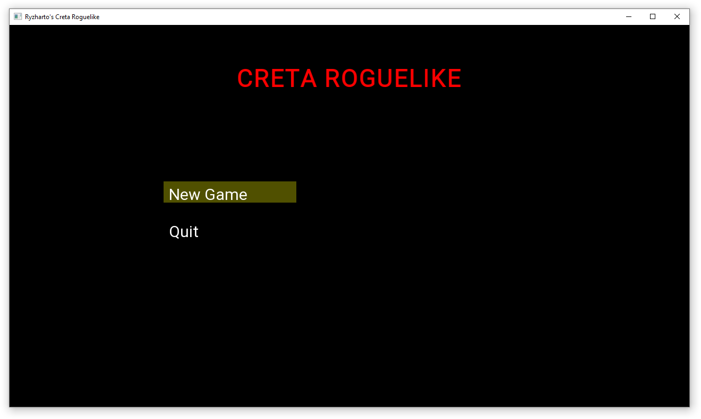
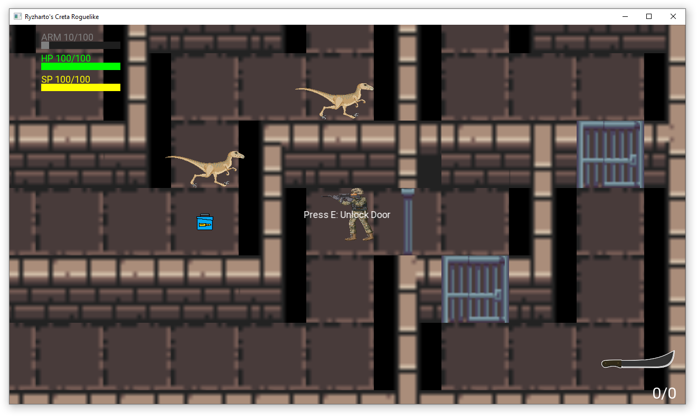
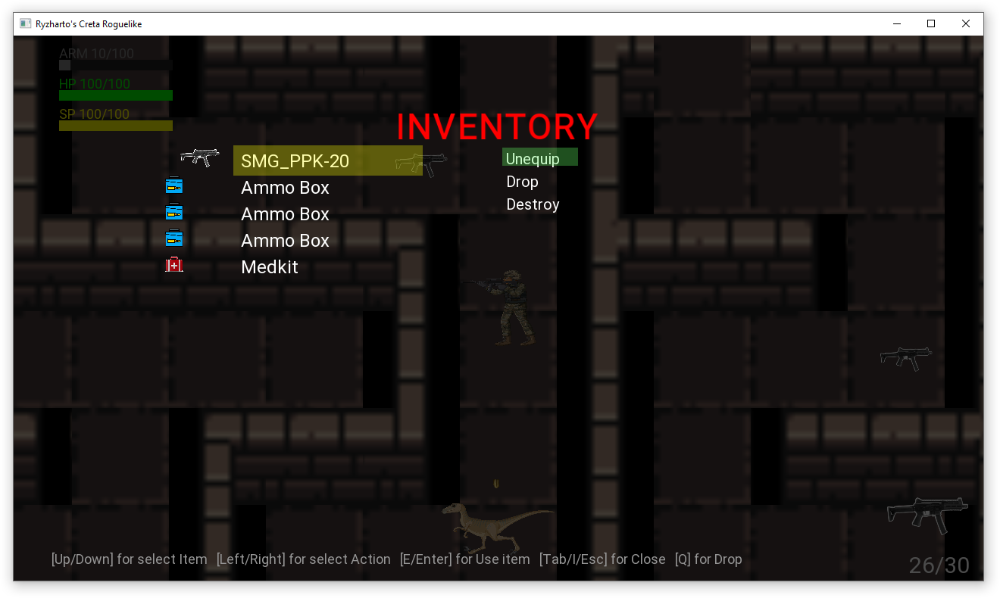

# Ryzharto's Creta Roguelike (рабочее название)

**Жанр:** 2D top‑down action roguelite / survival horror.  
**Платформа:** Windows (в перспективе macOS и Linux).  
**Технологии:** C++17, SFML 2.6, Visual Studio 2022.

---

## О проекте

Вы — оперативник спецподразделения, исследующий процедурно генерируемые комплексы, кишащие динозаврами. Цель: найти выход, попутно собирая оружие, припасы и ключи.
Данный проект выполнен в качестве дипломной работы для курса "C++ ДЛЯ РАЗРАБОТКИ ИГР" от онлайн-школы "XYZSchool".

### Основные возможности

- **Процедурная генерация лабиринтов** (алгоритм DFS) с автоматической расстановкой стен, дверей, врагов и предметов.
- **Боевая система:** огнестрельное оружие (пистолет‑пулемёт) и холодное оружие (мачете), переключение колёсиком мыши, перезарядка, сохранение патронов при смене оружия.
- **Простой инвентарь, экипировка оружия, дроп и уничтожение.
- **Разнообразные враги‑динозавры** с примитивным ИИ (преследование, атака в ближнем бою).
- **Мета‑прогрессия** (сохранение состояния игрока между уровнями).
- **Динамическое освещение и анимации** (в разработке).

---

## Как запустить

1. **Скачайте и установите Visual Studio 2022** (Community Edition подойдёт) с компонентами C++.
2. **Клонируйте репозиторий** или скачайте исходный код.
3. **Установите SFML 2.6.1** (например, через [официальный сайт](https://www.sfml-dev.org/download/sfml/2.6.1/)) или используйте менеджер пакетов (vcpkg, Conan). Убедитесь, что пути к библиотекам и заголовочным файлам прописаны в проекте.
4. **Откройте решение `Game.sln`** в Visual Studio.
5. **Соберите проект** (F7) и запустите (F5). Игра начнётся с главного меню.

---

## Управление

| Действие | Клавиша |
|----------|---------|
| Движение | `W` `A` `S` `D` |
| Стрельба / атака | Левая кнопка мыши |
| Взаимодействие (подобрать, открыть, взломать) | `E` |
| Перезарядка | `R` |
| Открыть/закрыть инвентарь | `Tab` или `I` |
| Использовать предмет / выбрать действие | `Enter` / `E` (в инвентаре) |
| Выбросить предмет | `Q` (в инвентаре) |
| Переключение оружия | Колёсико мыши |
| Пауза | `Escape` |

---

## Скриншоты

<!-- ⚠️ *Добавьте реальные скриншоты в папку `screenshots/` и вставьте их ниже.* -->

---

## Архитектура

Проект разделён на два компонента:

- **XYZEngine** – собственный движок на базе SFML с компонентной системой, физикой, UI, ресурсным менеджером и логгером.
- **RogaliqueGame** – игровая логика, использующая движок: генератор уровней, ИИ врагов, инвентарь, оружие, UI экраны.

---

## Лицензия

Проект распространяется под лицензией MIT (см. `LICENSE`).  
Авторы: Aleksandr Rybalka (polterageist@gmail.com), Ryzharto (ryzharto@yandex.ru).